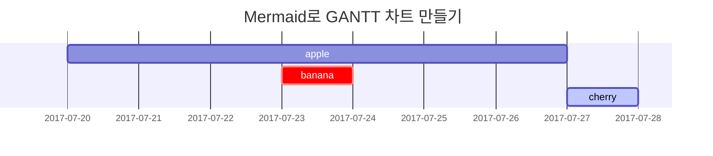

## 제목(Heading)

# H1 — 제목
{: .mt-4 .mb-0 }

## H2 — 제목
{: data-toc-skip='' .mt-4 .mb-0 }

### H3 — 제목
{: data-toc-skip='' .mt-4 .mb-0 }

#### H4 — 제목
{: data-toc-skip='' .mt-4 }

## 문단(Paragraph)

Quisque... (본문 내용은 생략 가능)

## 리스트(Lists)

### 순서 있는 리스트

1. 첫 번째
2. 두 번째
3. 세 번째

### 순서 없는 리스트

- 챕터
  - 섹션
    - 단락

### 할 일 목록 (ToDo list)

- [ ] 작업
  - [x] 1단계 완료
  - [x] 2단계 완료
  - [ ] 3단계 진행 중

### 설명 목록

태양  
: 지구가 공전하는 항성

달  
: 태양빛을 반사해 보이는 지구의 자연 위성

## 인용문(Block Quote)

> 이 줄은 _인용문_의 예시입니다.

## 강조 박스(Prompts)

> 팁 타입의 강조 박스 예시입니다.  
{: .prompt-tip }

> 정보 타입의 강조 박스 예시입니다.  
{: .prompt-info }

> 경고 타입의 강조 박스 예시입니다.  
{: .prompt-warning }

> 위험 타입의 강조 박스 예시입니다.  
{: .prompt-danger }

## 테이블(Tables)

| 회사 이름                  | 담당자           | 국가     |
| :------------------------- | :--------------- | -------: |
| Alfreds Futterkiste        | Maria Anders     | 독일     |
| Island Trading             | Helen Bennett    | 영국     |
| Magazzini Alimentari Riuniti | Giovanni Rovelli | 이탈리아 |

## 링크(Links)

<http://127.0.0.1:4000>

## 각주(Footnote)

훅을 클릭하면 각주로 이동합니다[^footnote], 또 다른 각주도 있습니다[^fn-nth-2].

## 인라인 코드(Inline code)

이건 `인라인 코드`의 예시입니다.

## 파일 경로 표시

이건 `/path/to/the/file.extend`{: .filepath} 와 같이 파일 경로를 표시하는 방법입니다.

## 코드 블록(Code blocks)

### 일반 코드

```text
이건 문법 강조 없는 일반 코드 블록입니다.
```

### 특정 언어 예시

```bash
if [ $? -ne 0 ]; then
  echo "명령어 실행 실패.";
  # 필요한 작업 실행 / 종료
fi;
```

### 특정 파일 예시

```sass
@import
  "colors/light-typography",
  "colors/dark-typography";
```
{: file='_sass/jekyll-theme-chirpy.scss'}

## 수식

The mathematics powered by [**MathJax**](https://www.mathjax.org/):

$$
\begin{equation}
  \sum_{n=1}^\infty 1/n^2 = \frac{\pi^2}{6}
  \label{eq:series}
\end{equation}
$$

수식은 이렇게 참조할 수 있습니다: \eqref{eq:series}.

When $a \ne 0$, there are two solutions to $ax^2 + bx + c = 0$ and they are

$$ x = {-b \pm \sqrt{b^2-4ac} \over 2a} $$

## Mermaid SVG



## Images

### Default (with caption)

{: width="972" height="589" }
_Full screen width and center alignment_

### Left aligned

{: width="972" height="589" .w-75 .normal}

### Float to left

{: width="972" height="589" .w-50 .left}
Praesent maximus aliquam sapien. Sed vel neque in dolor pulvinar auctor. Maecenas pharetra, sem sit amet interdum posuere, tellus lacus eleifend magna, ac lobortis felis ipsum id sapien. Proin ornare rutrum metus, ac convallis diam volutpat sit amet. Phasellus volutpat, elit sit amet tincidunt mollis, felis mi scelerisque mauris, ut facilisis leo magna accumsan sapien. In rutrum vehicula nisl eget tempor. Nullam maximus ullamcorper libero non maximus. Integer ultricies velit id convallis varius. Praesent eu nisl eu urna finibus ultrices id nec ex. Mauris ac mattis quam. Fusce aliquam est nec sapien bibendum, vitae malesuada ligula condimentum.

### Float to right

{: width="972" height="589" .w-50 .right}
Praesent maximus aliquam sapien. Sed vel neque in dolor pulvinar auctor. Maecenas pharetra, sem sit amet interdum posuere, tellus lacus eleifend magna, ac lobortis felis ipsum id sapien. Proin ornare rutrum metus, ac convallis diam volutpat sit amet. Phasellus volutpat, elit sit amet tincidunt mollis, felis mi scelerisque mauris, ut facilisis leo magna accumsan sapien. In rutrum vehicula nisl eget tempor. Nullam maximus ullamcorper libero non maximus. Integer ultricies velit id convallis varius. Praesent eu nisl eu urna finibus ultrices id nec ex. Mauris ac mattis quam. Fusce aliquam est nec sapien bibendum, vitae malesuada ligula condimentum.

### Dark/Light mode & Shadow

The image below will toggle dark/light mode based on theme preference, notice it has shadows.

{: .light .w-75 .shadow .rounded-10 w='1212' h='668' }
{: .dark .w-75 .shadow .rounded-10 w='1212' h='668' }

## Video



## Reverse Footnote

[^footnote]: The footnote source
[^fn-nth-2]: The 2nd footnote source
